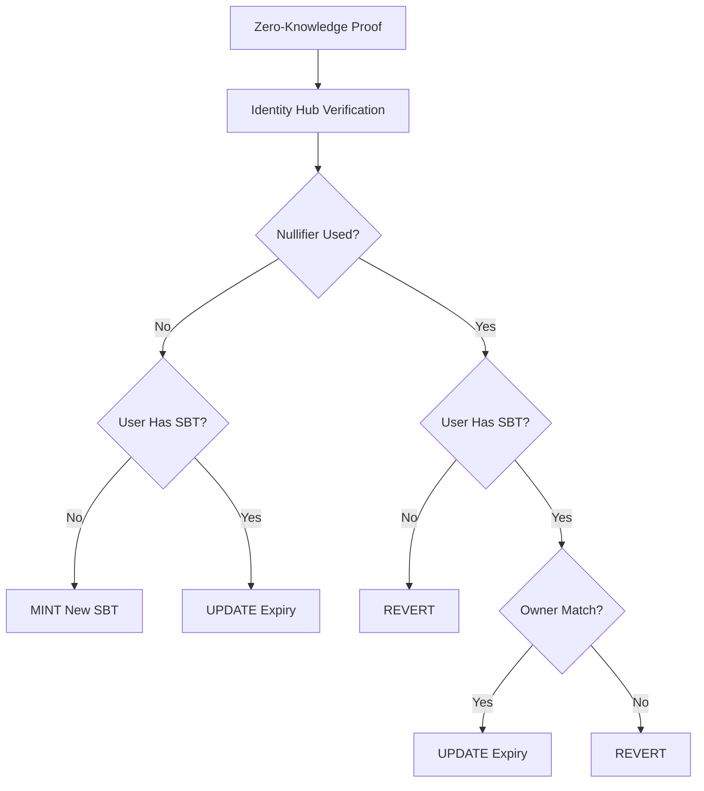

# SelfPassportSBTV1

Soulbound Token (SBT) contract implementing Self's identity verification system. Each user gets one non-transferable
token that proves verified identity status.

## Quick Start

```bash
# Clone and setup
git clone <repository-url>
cd self-sbt
forge install && pnpm install

# Compile and test
forge build
forge test

# Deploy (configure .env first)
forge script script/Deploy.s.sol --rpc-url $RPC_URL --private-key $PRIVATE_KEY --broadcast
```

## Core Features

- **One SBT per User**: Each address can only have one active token
- **Anti-Replay Protection**: Each nullifier can only be used by its original owner
- **Time-bounded Validity**: 180-day expiry period for all tokens
- **Soulbound**: Non-transferable via ERC5192 standard

## Logic Flow



## Logic Matrix

The contract handles four scenarios based on nullifier usage and receiver SBT ownership:

| Nullifier Status | Receiver Has SBT | Action             | Description                                    |
| ---------------- | ---------------- | ------------------ | ---------------------------------------------- |
| **NEW**          | **NO**           | **🟢 MINT**        | First-time mint: Create new SBT for receiver   |
| **NEW**          | **YES**          | **🟡 UPDATE**      | Edge case: Different passport for same address |
| **USED**         | **NO**           | **🔴 REVERT**      | Invalid: Nullifier already registered          |
| **USED**         | **YES**          | **🔍 CHECK OWNER** | Verify if nullifier owner matches receiver     |

### Case 4 Breakdown

| Nullifier Owner             | Receiver | Action        | Description                                          |
| --------------------------- | -------- | ------------- | ---------------------------------------------------- |
| **Same as receiver**        | Any      | **🟡 UPDATE** | Valid: Same user refreshing with their nullifier     |
| **Different from receiver** | Any      | **🔴 REVERT** | Invalid: User trying to use someone else's nullifier |

## Integration

### Smart Contract

```solidity
import { SelfPassportSBTV1 } from "./SelfPassportSBTV1.sol";

contract MyDApp {
    SelfPassportSBTV1 public immutable sbtContract;

    modifier requireValidSBT(address user) {
        uint256 tokenId = sbtContract.getTokenIdByAddress(user);
        require(tokenId != 0, "No SBT found");
        require(sbtContract.isTokenValid(tokenId), "SBT expired");
        _;
    }

    function restrictedFunction() external requireValidSBT(msg.sender) {
        // Only verified users can access
    }
}
```

### Frontend

```javascript
// Check user verification status
async function isUserVerified(userAddress) {
  const tokenId = await contract.getTokenIdByAddress(userAddress);
  if (tokenId === 0) return false;
  return await contract.isTokenValid(tokenId);
}

// Get user SBT details
async function getUserSBT(userAddress) {
  const tokenId = await contract.getTokenIdByAddress(userAddress);
  if (tokenId === 0) return null;

  const [isValid, expiry] = await Promise.all([contract.isTokenValid(tokenId), contract.getTokenExpiry(tokenId)]);

  return { tokenId, isValid, expiry };
}
```

## Deployment

### Environment Setup

```bash
# .env file
IDENTITY_VERIFICATION_HUB_ADDRESS=0x1234567890123456789012345678901234567890
SCOPE_VALUE=12345
ATTESTATION_ID_LIST=1,2,3
```

### Deploy Commands

```bash
# Testnet
forge script script/Deploy.s.sol --rpc-url $SEPOLIA_RPC_URL --private-key $PRIVATE_KEY --broadcast --verify

# Mainnet
forge script script/Deploy.s.sol --rpc-url $MAINNET_RPC_URL --private-key $PRIVATE_KEY --broadcast --verify --slow
```

## Security Model

- **Nullifier Binding**: Each nullifier permanently links to a specific token
- **Owner Protection**: Prevents cross-user nullifier theft
- **Expiry Enforcement**: Automatic 180-day validity period
- **Soulbound**: Immutable ownership after minting

## Testing

```bash
# Run all tests
forge test -vv

# Test specific cases
forge test --match-test "test_VerifySelfProof_Case"
```

**Test Coverage**: 7 tests covering all 4 logic cases plus utility functions

## Error Handling

- `RegisteredNullifier()`: Thrown when nullifier is already used inappropriately
- `ERC5192Locked()`: Thrown when attempting to transfer soulbound tokens

## License

MIT License
