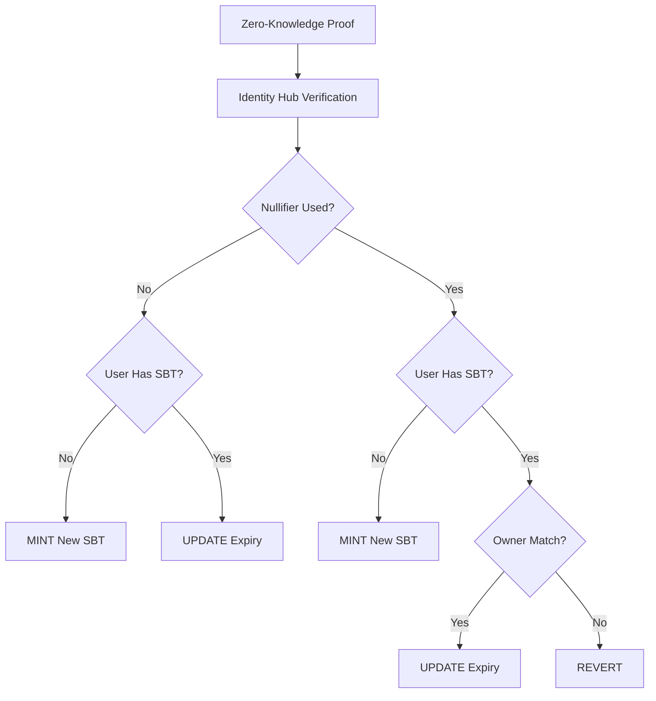

# SelfSBTV2

Soulbound Token (SBT) contract implementing Self's identity verification system. Designed with the **one dapp ↔ one
SBT** model where each dApp deploys their own SBT contract for isolated, privacy-preserving identity verification.

## Quick Start

```bash
# Clone and setup
git clone https://github.com/selfxyz/self-sbt.git
cd self-sbt
forge install && pnpm install

# Compile and test
forge build
forge test

# Deploy using manual pipeline
# See DEPLOYMENT.md for complete instructions
```

## Privacy-First Architecture

The **one dapp ↔ one SBT** model ensures:

- **Isolated Identity Verification**: Each dApp has its own SBT contract with separate nullifier spaces
- **No Cross-dApp Tracking**: Users can't be linked across different applications
- **dApp-Specific Policies**: Each deployment can have custom validity periods and governance rules
- **Granular Privacy Control**: Users prove identity to individual applications without revealing cross-platform
  activity

## Core Features

- **One SBT per User**: Each address can only have one active token per dApp
- **Anti-Replay Protection**: Each nullifier can only be used by its original owner
- **Configurable Validity**: Owner-controlled expiry periods
- **Soulbound**: Non-transferable via ERC5192 standard
- **Owner Controls**: Burn capability and validity period management

## Owner Capabilities

The contract owner (typically the dApp) can:

- **Set Validity Period**: Customize token expiry duration for their use case
- **Burn Tokens**: Remove user SBTs when necessary (abuse, violations, etc.)
- **Transfer Ownership**: Change contract control as needed

```solidity
// Set custom validity period (e.g., 30 days for short-term verification)
sbtContract.setValidityPeriod(30 days);

// Burn a specific user's token
sbtContract.burnSBT(tokenId);

// Transfer ownership
sbtContract.transferOwnership(newOwner);
```

## Logic Flow



## Logic Matrix

The contract handles four scenarios based on nullifier usage and receiver SBT ownership:

| Nullifier Status | Receiver Has SBT | Action                | Description                                    |
| ---------------- | ---------------- | --------------------- | ---------------------------------------------- |
| **NEW**          | **NO**           | **🟢 MINT**           | First-time mint: Create new SBT for receiver   |
| **NEW**          | **YES**          | **🟡 UPDATE**         | Edge case: Different passport for same address |
| **USED**         | **NO**           | **🔍 RECOVER/REVERT** | Recover burned token or revert if still active |
| **USED**         | **YES**          | **🔍 CHECK OWNER**    | Verify if nullifier owner matches receiver     |

### Case 3 Breakdown

| Token Owner      | Action         | Description                                 |
| ---------------- | -------------- | ------------------------------------------- |
| **address(0)**   | **🟢 RECOVER** | Token was burned, recover to new address    |
| **Active owner** | **🔴 REVERT**  | Token still active, ask admin to burn first |

### Case 4 Breakdown

| Nullifier Owner             | Receiver | Action        | Description                                          |
| --------------------------- | -------- | ------------- | ---------------------------------------------------- |
| **Same as receiver**        | Any      | **🟡 UPDATE** | Valid: Same user refreshing with their nullifier     |
| **Different from receiver** | Any      | **🔴 REVERT** | Invalid: User trying to use someone else's nullifier |

## Recovery Workflows

The SBT contract supports two distinct recovery scenarios through different mechanisms:

### Lost Passport Recovery ✅

**Scenario**: User loses passport but retains wallet access  
**Solution**: Direct re-verification (no admin action needed)

1. User obtains new passport (generates new nullifier)
2. User proves identity with new nullifier to same wallet
3. **Case 2 triggers**: NEW nullifier + HAS SBT = update existing token expiry

### Lost Wallet Recovery ✅

**Scenario**: User loses wallet access but retains same passport  
**Solution**: Admin burn + token recovery

1. User reports lost wallet to admin
2. Admin calls `burnSBT(tokenId)` to burn existing SBT
3. User proves identity with same nullifier to new wallet
4. **Case 3 triggers**: USED nullifier + NO SBT + burned token = recovery
5. Same token ID gets minted to new address

### Key Design Features

- **Permanent Nullifier Binding**: Each nullifier permanently maps to one token ID throughout entire lifecycle
- **Admin-Mediated Recovery**: All recovery requires explicit admin intervention for security
- **Token ID Persistence**: Lost wallet recovery preserves original token ID
- **Automatic Prevention**: Active tokens cannot be hijacked (Case 3 reverts if token still owned)

### Recovery Commands

```solidity
// Admin burns user's SBT for recovery
sbtContract.burnSBT(tokenId);

// Check if nullifier can be recovered
bool canRecover = sbtContract.isNullifierUsed(nullifier) &&
                  sbtContract.getTokenIdByAddress(userAddress) == 0;
```

### Security Considerations

**Known Limitation: Nullifier Ambiguity Attack**

Due to the zero-knowledge nature of the system, there is no cryptographic way to distinguish between:

- Same person renewing expired passport (legitimate Case 2)
- Different person targeting existing wallet (potential attack)

Both scenarios result in multiple nullifiers mapping to the same token ID. This creates a theoretical attack vector
where:

1. Attacker triggers Case 2 to link their nullifier to victim's token
2. Attacker requests admin to burn the token
3. Attacker recovers the token to their own wallet via Case 3

**Mitigation Strategies:**

- **Admin Due Diligence**: Implement robust identity verification before processing burn requests
- **User Education**: Document that sharing wallet addresses reduces security
- **Monitoring**: Track unusual patterns in Case 2 triggers and recovery requests
- **Future Enhancement**: Consider hierarchical identity systems for cryptographic continuity

This limitation is inherent to privacy-preserving identity systems and represents the classic tradeoff between privacy
and verifiable identity continuity.

## Integration

### Smart Contract

```solidity
import { SelfSBTV2 } from "./SelfSBTV2.sol";

contract MyDApp {
    SelfSBTV2 public immutable sbtContract;

    modifier requireValidSBT(address user) {
        uint256 tokenId = sbtContract.getTokenIdByAddress(user);
        require(tokenId != 0, "No SBT found");
        require(sbtContract.isTokenValid(tokenId), "SBT expired");
        _;
    }

    function restrictedFunction() external requireValidSBT(msg.sender) {
        // Only verified users can access
    }
}
```

### Frontend

```javascript
// Check user verification status
async function isUserVerified(userAddress) {
  const tokenId = await contract.getTokenIdByAddress(userAddress);
  if (tokenId === 0) return false;
  return await contract.isTokenValid(tokenId);
}

// Get user SBT details
async function getUserSBT(userAddress) {
  const tokenId = await contract.getTokenIdByAddress(userAddress);
  if (tokenId === 0) return null;

  const [isValid, expiry, validityPeriod] = await Promise.all([
    contract.isTokenValid(tokenId),
    contract.getTokenExpiry(tokenId),
    contract.getValidityPeriod(),
  ]);

  return { tokenId, isValid, expiry, validityPeriod };
}
```

## Deployment

SelfSBTV2 includes a deployment pipeline that handles scope generation and contract deployment using TypeScript and Foundry.

### 🛠️ Manual Deployment

Deploy using the TypeScript scope calculator and Foundry:

```bash
# 1. Calculate scope value
cd ts-scripts && pnpm install && pnpm run dev

# 2. Deploy with Foundry using placeholder scope value
export PLACEHOLDER_SCOPE="0x..." # Use value from step 1
forge script script/DeployV2.s.sol:DeployV2 --rpc-url $RPC_URL --broadcast

# 3. Set actual scope on deployed contract
# (Use the contract's setScope function with calculated value)
```

### ⚙️ Development Testing

```bash
# Quick test deployment for development
forge script script/DeployV2.s.sol:DeployV2 --rpc-url $RPC_URL --broadcast

# This uses placeholder scope - suitable for testing only
# For production, use GitHub Actions workflow
```

### 📋 Required Parameters

- `OWNER_ADDRESS` - Contract owner address
- `VERIFICATION_CONFIG_ID` - Verification config (bytes32)
- `SCOPE_SEED` - Scope identifier from your frontend Self SDK
- For Celo networks, hub addresses and RPC URLs are predefined

### 📖 Detailed Guide

For complete deployment instructions, troubleshooting, and advanced configuration options, see
**[DEPLOYMENT.md](./DEPLOYMENT.md)**.

## Security Model

- **Nullifier Binding**: Each nullifier permanently links to a specific token within this dApp's scope
- **Owner Protection**: Prevents cross-user nullifier theft
- **Configurable Expiry**: Owner-controlled validity periods for different use cases
- **Soulbound**: Immutable ownership after minting
- **Privacy Isolation**: No linkability across different dApp deployments

## Testing

```bash
# Run all tests
forge test -vv

# Test specific functionality
forge test --match-test "test_VerifySelfProof_Case"
forge test --match-test "test_BurnSBT"
forge test --match-test "test_SetValidityPeriod"
```

**Test Coverage**: 22 tests covering all 4 logic cases, owner functions, signature verification, and edge cases

## Error Handling

- `RegisteredNullifier()`: Thrown when nullifier is already used inappropriately
- `ERC5192Locked()`: Thrown when attempting to transfer soulbound tokens
- `InvalidValidityPeriod()`: Thrown when setting validity period to zero
- `Ownable: caller is not the owner`: Thrown when non-owner tries to call owner functions

## License

MIT License
